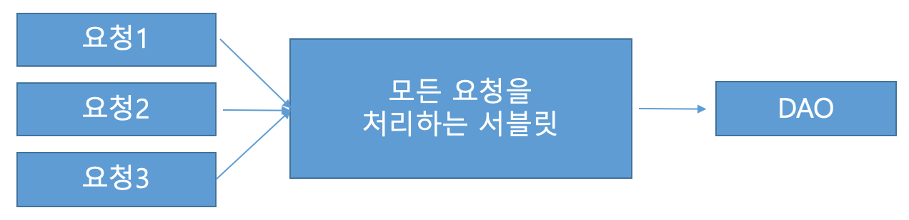
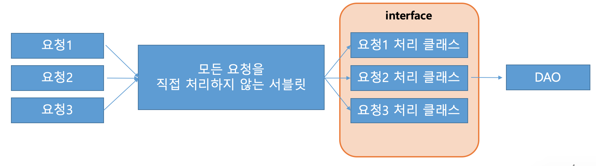

+ STEP 1. URI-pattern
	+ STEP 1.1 디렉터리 패턴
    + STEP 1.2 확장자 패턴
+ STEP 2. FrontController-pattern
	+ STEP 2.1 FrontController-pattern이란?
    + STEP 2.2 FrontController-pattern 예제 소스
+ STEP 3. Command-pattern
	+ STEP 3.1 Command-pattern이란?
	+ STEP 3.2 Command-pattern 예제 소스
+ STEP 4. Review

# 개요
MVC 패턴을 통한 Servlet WebApplication을 만들 때 사용하는 주된 패턴 중에 하나이다.
앞으로 계속해서 서블릿과 JSP 그리고 스프링에 대해서 포스팅을 하게 될 것인데, 나머지 부분은 양적인 측면으로 정리할게 많아서 먼저 정리를 해본다.

상당 부분 인프런의 [실전-jsp-강좌](https://www.inflearn.com/course/%EC%8B%A4%EC%A0%84-jsp-%EA%B0%95%EC%A2%8C/lecture/1158) 를 참고하였으니, 보다 자세히 보고싶은 사람들은 여기를 보면 될 것 같다.

## STEP 1.1 디렉토리 패턴
아주 단순한 구조의 url 패턴이라고 볼 수가 있다. 디렉토리 형태로 서버의 해당 컴포넌트를 찾아서 실행하는 구조이다.

예시를 들면, 다음과 같다.
> http://127.0.0.1/top-ing/hello 

> http://127.0.0.1/top-ing/world

이렇게 디렉토리 패턴을 사용하여 url을 설계를 하면, hello 디렉토리를 클라이언트가 요청했을 때는 /hello 서블릿이 반환되며, world 디렉토리를 요청했을 경우에는 /world 서블릿이 반환이 된다.

## STEP 1.2 확장자 패턴
확장자 형태로 서버의 해당 컴포넌트를 찾아서 실행하는 구조이다. 

예시를 들면, 다음과 같다.

> http://127.0.0.1/top-ing/hello.do

> http://127.0.0.1/top-ing/world.do

이런 경우에는 디렉토리 패턴과 다르게 클라이언트가 hello.do를 요청하던 world.do를 요청하던 간에 *.do 서블릿이 모두 받아서 처리한다.

그렇다면 hello.do를 요청했을 때와 world.do를 요청했을 때와 하는 일이 같은가?
아니다. 여러개의 응답을 동시에 처리하는 *.do 서블릿에서 클라이언트의 요청에 맞게 요청을 구분을 해준다.

## STEP 2.1 FrontController-pattern
단순하게 말하자면, **클라이언트의 다양한 요청을 한 곳으로 집중시켜, 개발 및 요지보수에 효율을 극대화하는 패턴이다.**

만약, 다양한 요청마다 서블릿을 하나하나 서블릿을 만든다하면 유지보수 및 개발의 효율이 떨어질 수 밖에 없을 것이다.
따라서 프론트컨트롤러 패턴은 각각의 분기를 처리해주는 어떠한 컨트롤러를 앞 단에 두어(그래서 FrontController)각 요청에 맞게끔 분기하여 처리해주는 패턴을 말한다.


소스를 보자!

## STEP 2.2 FrontController-pattern 예제 소스
```html
... (중략) ...

	<a href="insert.do">insert</a>
	<hr />
	<a href="http://localhost:8080<%=request.getContextPath()%>/update.do">update</a>
	<hr />
	<a href="http://localhost:8080/top-ing/select.do">select</a>
	<hr />
    <a href="<%=request.getContextPath()%>/delete.do">delete</a>

... (중략) ...
```

위와 같은 소스가 존재한다고 가정을 해보자.

`insert, update, select, delete` 와 같이 다양한 요청을 요구할 수 있는 JSP 페이지이다.

```java
// *.do 확장자를 모두 처리하겠다고 명시
@WebServlet("*.do")
public class FrontCon extends HttpServlet {
	private static final long serialVersionUID = 1L;
    
    public FrontCon() {
        super();
    }

	protected void doGet(HttpServletRequest request, HttpServletResponse response) throws ServletException, IOException {
		System.out.println("doGet");
		actionDo(request, response);
	}

	protected void doPost(HttpServletRequest request, HttpServletResponse response) throws ServletException, IOException {
		System.out.println("doPost");
		actionDo(request, response);
	}
	
	private void actionDo(HttpServletRequest request, HttpServletResponse response) throws ServletException, IOException {
		System.out.println("actionDo");
		/*
         * 이 부분은 밑에서 다시 설명하겠지만, 주석으로 설명을 해보겠다. 
         * 1. getRequestURI() 메소드를 통해서 요청된 전체 uri를 가져온다.
         *      e.g) http://localhost:8080/top-ing/hello.do -> top-ing/hello.do
         * 2. getContextPath() 메소드를 통해서 프로젝트의 Context Path명을 가져온다.
         *      e.g) http://localhost:8080/top-ing/hello.do -> top-ing/
         * 3. substring() 메소드를 통해서, ContextPath를 전체 uri에서 지운다. 
         *      e.g) top-ing/hello -> hello.do
         * 4. actionDo() 메소드에서는 substring 결과값(command)을 통해서 요청을 분기한다. 
         */
		String uri = request.getRequestURI();
		System.out.println("uri : " + uri);
		String conPath = request.getContextPath();
		System.out.println("conPath : " + conPath);
		String command = uri.substring(conPath.length());
		System.out.println("command : " + command);

		if(command.equals("/insert.do")){
			System.out.println("insert");
			System.out.println("----------------");
		}else if(command.equals("/update.do")){
			System.out.println("update");
			System.out.println("----------------");
		}else if(command.equals("/select.do")){
			System.out.println("select");
			System.out.println("----------------");
		}else if(command.equals("/delete.do")){
			System.out.println("delete");
			System.out.println("----------------");
		}
	}
}
```

## STEP 3.1 Command-pattern
클라이언트로부터 받은 요청들에 대해서, 서블릿이 작업을 직접 처리 하지 않고, 해당 클래스가 처리하도록 하는 패턴이다.

무슨 말인지 잘 와닿지않을 수 있기때문에, 위의 소스코드를 인용하여 설명해보겠다.

```java
...(중략)...
	if(command.equals("/insert.do")){
			System.out.println("insert");
			System.out.println("----------------");
		}else if(command.equals("/update.do")){
			System.out.println("update");
			System.out.println("----------------");
		}else if(command.equals("/select.do")){
			System.out.println("select");
			System.out.println("----------------");
		}else if(command.equals("/delete.do")){
			System.out.println("delete");
			System.out.println("----------------");
		}
...(중략)...
```
이 부분이 `doAction`에서 클라이언트의 요청을 분기하는 부분이 될 것이다.
하지만 만약에 클라이언트가 요청할 수 있는 것들이 수십~수백개가 된다면 어떤일이 발생할까?
계속해서, `else if ...` 으로 분기를 처리해야될까? 

그래서 나온 방법이 **모든 요청을 직접 처리하지 않고, 다른 서블릿에 처리**를 보내는 것이다.
더 자세히 말하면 MVC 패턴으로 웹 어플리케이션을 구현할 때, 프론트컨트롤러 패턴을 적용한 서블릿의 요청 개수가 많아질수록 코드가 난잡해지니 각각의 커맨드 클래스로 분산 시키는 방식을 사용한다. 

소스를 보자!
## STEP 3.2 Command-pattern 예제 소스

일단, 먼저 가정을 해보자.
memberDB의 접근을 위한 memberDAO가 있고, 그것을 사용하는 DTO가 있다고 가정하자.
여기서 DTO, DAO를 잘 모르겠다면, 자세히 설명된 링크 [^1]가 있으니 참고하자. 

우리가 위에서 봤던 Front.con 파일에 DB에 등록된 모든 멤버들의 정보들을 볼 수 있는 요청을 추가했다고 가정하자.
클라이언트는 membersAll.do를 요청했다고 가정한다.

```java
...(중략)...
private void actionDo(HttpServletRequest request, HttpServletResponse response) throws ServletException, IOException {
		// TODO Auto-generated method stub
		System.out.println("actionDo");
		
		String uri = request.getRequestURI();
		String conPath = request.getContextPath();
		String command = uri.substring(conPath.length());

        //추가된 로직 부분

		if(command.equals("/membersAll.do")) {
			response.setContentType("text/html; charset=EUC-KR");
			PrintWriter writer = response.getWriter();
			writer.println("<html><head></head><body>");

            /*
             * membersAll을 처리하는 서비스를 만들어서 사용한다.
             * 커맨드로 분기한 후에 DAO처리를 여기서 수행하는 것이 아니라
             * 해당 커맨드 인터페이스인 MembersAllService만 만들어서 사용한다.
             */
			Service service = new MembersAllService();
			ArrayList<MemberDto> dtos = service.execute(request, response);
			
			for (int i = 0; i < dtos.size(); i++) {
				MemberDto dto = dtos.get(i);
				String id = dto.getId();
				String pw = dto.getPw();
				String name = dto.getName();
				String eMail = dto.geteMail();
				Timestamp rDate = dto.getrDate();
				String address = dto.getAddress();
				
				writer.println(id + ", " + pw + ", " + name + ", " + eMail + ", " + rDate.toLocalDateTime() + ", " + address + "<hr />");
			}
			
			writer.println("</body></html>");
        }
}
...(중략)...

//Service.java
public interface Service {
    //단순하게 execute() 메소드만 선언된 인터페이스를 활용하여, 프론트컨트롤러에서 사용하게끔 한다.
    //세부 로직은 Service를 구현하는 구현체에서 처리한다. 
	public ArrayList<MemberDto> execute(HttpServletRequest request, HttpServletResponse response);
}


//MeberAllservice.java 
public class MembersAllService implements Service {
	
	public MembersAllService() {}

	@Override
	public ArrayList<MemberDto> execute(HttpServletRequest request, HttpServletResponse response) {
        
        //여기서 DAO를 생성 후에 DAO의 메소드인 membersAll()을 호출한다. 
		MemberDao dao = MemberDao.getInstance();
		return dao.membersAll();
	}

}
```
여기서 Service를 구현한 MembersAllService 인터페이스를 볼 수가 있는데 이렇듯, 만약에 다른 요청이 들어와도, URI를 프론트컨트롤러에서 분기처리한 후에 해당 서비스에 맞는 서비스를 생성한 후에, `service.excute()` 처리만 함으로써 다양한 요청 처리를 다른 클래스에 위임할 수가 있다.


# STEP 4. Review

전체적으로 정리하고, 이번 포스팅을 마무리 짓도록 하겠다.

원시적으로, 모든 요청마다 서블릿을 하나하나 생성하는 방법은 다음과 같다.


이러한 방식의 문제점은 계속해서 클라이언트가 할 수 있는 요청의 수가 증가할 때마다 서블릿 수가 증가한다는 문제점이 있다. 이를 해결하고자, FrontController 패턴이 대두하였고 아래와 같다.



하지만, FrontController 패턴 또한, 요청이 많아 질수록 처리해야되는 분기가 많아지는 문제점이 발생하여,
URI 분기는 FrontController에서 처리하고, 나머지 세부로직은 인터페이스를 처리하게끔 하려했고, 그에 따라 Command 패턴이 대두되게 되었다.



이처럼, 인터페이스를 활용하여 각 요청에 대한 세부로직은 인터페이스가 처리하며, FrontController에 위치한 서블릿은 URI 분기만 처리해주는 식으로 발전했고 이 방식은 Servlet MVC에서 많이 쓰이는 방식이다.

[^1]:[DAO vs DTO(=VO) 개념 알아보기](https://jungwoon.github.io/common%20sense/2017/11/16/DAO-VO-DTO/)


