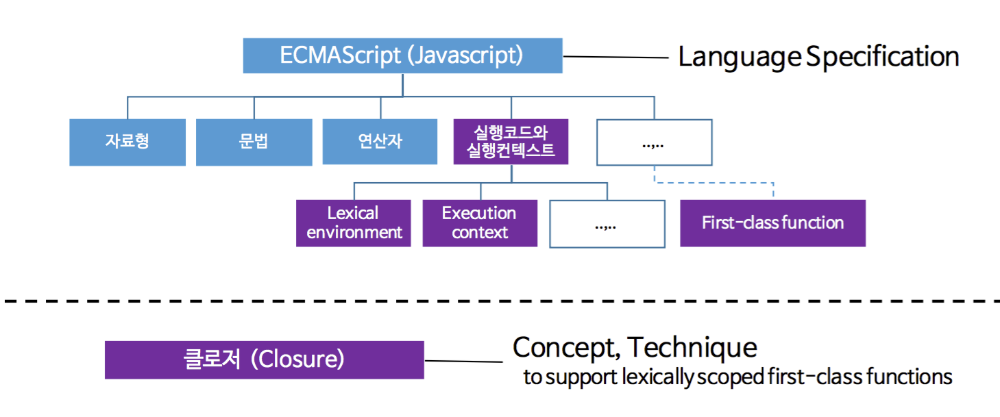
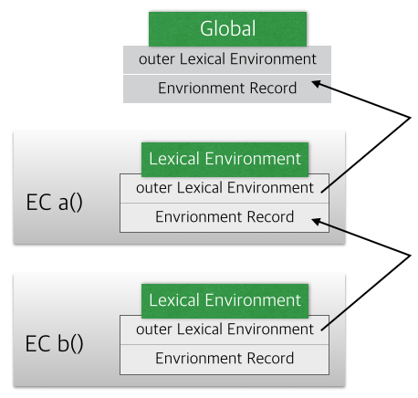

- STEP 1. ES6 VS ES6 이전 자바스크립트
  - STEP 1.1 let 키워드
  - STEP 1.2 호이스팅(Hoisting)
  - STEP 1.3 자바스크립트 실행컨텍스트(JavaScript Execution Context)
    - STEP 1.3.1 생성 단계(Creation Phase)
    - STEP 1.3.2 실행 단계(Execution Phase)
- STEP 4. Review
- STEP 5. Reference

# STEP 1. ES6 vs ES6 이전 자바스크립트

기존의 ES6 이전의 자바스크립트에서는 블록단위의 스코프가 존재하지 않았다.

```javascript
var name = 'global var';

function home() {
  var homevar = 'homevar';
  for (var i = 0; i < 100; i++) {}
  console.log(i);
}
home();
```

C나 Java등 많은 프로그래밍언어를 했던 사람이라면, for문 안에서 돌아가는 i에 대해서
이 코드를 동작하면 생각하는 결과로는 에러를 뿜을 것이라고 생각을 할 것이다.

왜냐? for문 안에서만 사용될 i가 100번 돌고나서 메모리 상에서 사라질 것이라고 생각하기 때문이다.

하지만, 결과는 우리가 예상한 것과 다르다.
저 코드를 돌려보면, **100**이라는 값이 나오는 것을 확인할 수가 있다.
어째서 그런 것일까?

ES6 이전의 자바스크립트는 블록 레벨 스코프(Block-level scope)를 따르는 것이 아니라, 함수 레벨 스코프(Function-level scope)를 따랐기 때문이다.

이 두개가 정확히 무엇일까?

1. **함수 레벨 스코프(Function-level scope)**
   함수 내에서 선언된 변수는 함수 내에서만 유효, 함수 외부에서는 참조할 수 없다.
   즉, 함수 내부에서 선언한 변수는 **지역 변수**이며, 외부에서 선언한 변수는
   모두 **전역 변수**이다.


    2. **블록 레벨 스코프(Block-level scope)**
    모든 코드 블록(함수, if문, for문, while 문, try/catch 문 등) 내에 선언된 변수는
        해당 코드  블록 내에서만 유효, 코드 블록 외부에서는 참조할 수 없다.
        즉, 코드 블록 내부에서 선언한 변수는 **지역 변수**이다.

또한 ES5까지 변수를 선언할 수 있는 유일한 방법은 **var** 키워드였다.
이 키워드는 아래와 같은 특징이 있고, 타 언어 대비하여 주의를 기울이지 않으면 치명적인 문제를 야기할 수가 있는 것들이 있었다.

대표적인 것이 위에서 말한 var 키워드로 생성한 변수는 **함수 레벨 스코프**을 따른 다는 것이다.

그 외에는 아래와 같다.

- var 키워드 생략 허용
  > 암묵적 전역 변수 양산할 가능성이 크다.
- 변수 중복 선언 허용
  > 의도하지 않은 변수값의 변경이 일어날 가능성이 크다.
- 변수 호이스팅
  > 변수를 선언하기 이전에 참조할 수 있다.

대부분의 문제는 **전역 변수**로 인해 발생한다.
우리가 학부 1학년 C언어 수업을 들을 때도 배우듯이 전역 변수를 활용하면서 편한 장점도 있지만, 대부분의 경우에는 **스파게티 코드**를 양산한다는 문제점이 있다는 것을 알고 있다.

ES5 까지의 자바스크립트는 이러한 문제를 안고 있었다.

따라서 위의 코드는 **함수 레벨 스코프**를 따르는 var 키워드를 통해 생성된 변수 i가
for문을 통해서 100까지 증가되었고, 스코프가 블록이 아닌 함수이기 때문에 for문이 끝난 이후에도 i 값이 100으로 참조가 가능한 것이다.

이러한 문제를 ES6에서는 어떻게 해결하였을까?

## STEP 1.1 let 키워드

```javascript
var name = 'global var';

function home() {
  var homevar = 'homevar';
  for (let i = 0; i < 100; i++) {}
  console.log(i);
}
home();
```

여기서는 단순하게, `var i`를 `let i`로 바꾼 거밖에 없는 코드이다.
결과 값은 어떻게 될까?

`ReferenceError: i is not defined` 우리가 C와 Java에서 사용했을 때와 같이 에러가 출력이 된다. 어떻게 된 일일까?

엄청 단순하다. `let` 키워드의 역할은**함수 레벨 스코프**를 **블록 레벨 스코프**로 바꿔준 것이다.

이것을 제외하고도, let 키워드는 많은 장점이 있다.

1. 변수 중복 선언 금지

```javascript
var foo = 123;
var foo = 456;

let bar = 123;
let bar = 456;

console.log(foo); // 456이 찍힘
console.log(bar); // SyntaxError: Identifier 'bar' has already been declared
```

위에서 설명한 것과 같이 var 키워드는 동일한 이름을 갖는 변수를 중복 선언 가능하지만, **let 키워드로는 동일한 이름을 갖는 변수를 중복해서 선언할 수가 없다.**

이 후에는 호이스팅과 클로저가 있는데 이는 내용이 길 것같으므로, 따로 챕터를 나눠서 설명해보도록 하겠다.

## STEP 1.2 호이스팅(Hoisting)

```javascript
console.log(foo); // ① undefined
var foo = 123;
console.log(foo); // ② 123
{
  var foo = 456;
}
console.log(foo); // ③ 456
```

맨 위의 예시를 들었던 코드를 보면, 기존 C나 Java를 공부했던 사람들이라면, 에러가 뿜어질 것이라고 예상할 것이라고 필자가 예상한 바 중에 에러를 뿜는다는 부분이 있었다.
foo가 선언되기 이전 `console.log(foo);`을 보면 undefined라고 출력이 되는데,
다른 언어와 달리 어째서 참조를 할 수 있으며, **undefined**라는 값을 뿜게 되는 것일까?

이것은 자바스크립트의 특징 중에 하나로 **모든 선언문은 호이스팅(Hoisting)되기 때문**이다.

호이스팅이란 var 선언문이나 function 선언문 등 모든 선언문이 해당 Scope의 선두로 옮겨진 것처럼 동작하는 특성을 말한다. **즉, 자바스크립트의 모든 선언문(var, let, const, function, function\*, class)이 선언되기 이전에 참조 가능하다.**

자바스크립트의 변수 생성 및 호이스팅 과정을 알아 보자!
자바 스크립트의 보다 자세한 내용은 Exeution Context을 보자, 변수 생성 및 호이스팅 과정은 아래와 같은 단계로 이뤄진다.

1. 선언 단계(Declaration phase) + 변수 객체(Variable Object; VO)에 변수를 등록한다. (이 VO는 스코프가 참조하는 대상이 된다.)
2. 초기화 단계(Initialization phase) + VO에 등로된 변수를 메모리에 할당한다. (이 단계에서 변수는 undefined로 초기화된다.)
3. 할당 단계(Assignment phase) + undefined로 초기화된 변수에 실제 값을 할당한다.

**var 키워드로 선언된 변수는 선언 단계와 초기화 단계가 한번에 이루어진다.**
즉, 스코프에 변수가 등록되고, 메모리 할당 후에 undefined로 초기화가 되는 것이다.
따라서, 위와 같이 선언문 이전에 변수에 접근하여도 VO에 변수가 존재하기 때문에 에러가 발생하지 않고, **undefined를 반환**하는 것이다.
이러한 현상을 **변수 호이스팅(Variable Hoisting)** 이라 한다.

다시 이를 통해 위의 코드를 분석해보면,
①이 실행되기 이전에 `var foo = 123;`이 호이스팅 되어 ①구문 앞에 `var foo;`가 옮겨진다. 하지만, 변수 선언 단계와 초기화 단계가 할당 단계와 분리되어 진행되기 때문에, 이 단계에서 foo에는 `undefined`가 할당되어 있다.

②에서는 변수에 값이 할당되었기 때문에 123이 출력된다.

③이전에 말했듯이 var 키워드는 함수 레벨 스코프를 지니므로, 같은 이름의 변수를 재할당할 수가 있다. 그러므로 값이 456이 나오는 것이다.

그렇다면? let 키워드의 경우에는 호이스팅이 어떻게 동작할까?

var 키워드와 달리 let 키워드로 선언된 변수를 선언문 이전에 참조하면 참조 에러(ReferenceError)가 발생한다. 이는 let 키워드로 선언된 변수는 일시적 사각지대(Temporal Dead Zone; TDZ)에 빠지기 때문이다.

```javascript
console.log(foo); // ReferenceError: foo is not defined

let foo = 123;
```

**let 키워드로 선언된 변수는 var 키워드와 달리 선언 단계와 초기화 단계가 분리되어 진행된다.** 즉, 스코프에 변수를 등록하지만, 초기화 단계는 변수 선언문에 도달했을 때 이루어진다.

**따라서, 초기화 이전에 변수에 접근하려하면 참조 에러(ReferenceError)가 발생한다.** 상세히 말하면 변수를 위한 메모리 공간이 아직 확보되지 않았기 때문이다. 따라서 스코프의 시작부터 초기화 시작 지점까지는 변수를 참조할 수 없으며, 이 구간을 **일시적 사각지대(TDZ)** 라 부른다.

> **Temporal dead zone and errors with let**
> In ECMAScript 2015, let will hoist the variable to the top of the block. However, referencing the variable in the block before the variable declaration results in a ReferenceError. The variable is in a "temporal dead zone" from the start of the block until the declaration is processed.

```javascript
// 스코프 선두에서 선언 단계 실행
// 아직 변수가 초기화 X
// 따라서 참조 불가
console.log(foo); // ReferenceError: foo is not defined

let foo; // 초기화 수행
console.log(foo); // undefined

foo = 1; // 할당 수행
console.log(foo); // 1
```

이렇게 보면, ES6에서는 호이스팅이 발생하지 않는 것처럼 보인다. 하지만 그렇지가 않다. 아래의 예제를 참고해보자.

```javascript
let foo = 1; // 전역 변수

{
  console.log(foo); // ReferenceError: foo is not defined
  let foo = 2; // 지역 변수
}
```

위 예제의 경우 전역 변수 foo의 값이 출력될 것처럼 예상이 된다. 하지만, ES6 선언문도 호이스팅이 발생하기 때문에 참조 에러가 발생한다. 이 경우에는 지역 변수 foo도 해당 스코프에서 호이스팅이 되고, 일시적 사각지대에 빠진다. 따라서 전역 변수의 foo의 값이 아니라, 참조에러가 발생하는 것이다.

클로저를 들어가기 앞서, 선행 지식으로 자바스크립트 실행 컨텍스트에 대한 이해가 필요하므로, 해당 내용을 먼저 정리해보도록 하겠다.

## STEP 1.3 자바스크립트 실행컨텍스트(JavaScript Execution Context)



**실행 컨텍스트란 자바스크립트 코드가 실행되고 연산되는 범위를 나타내는 추상적인 개념이다.[^1]** 이게 무슨 말일까? **실행 컨텍스트는 실행 가능한 코드가 실행되기 위해 필요한 환경**이라고 이해하면 된다. 그렇다면? 실행 컨텍스트는 어떻게 만들어지고 변수와 함수는 어떤 스코프를 따르는지 이해가 필요하다.

자바스크립트 엔진은 코드를 실행하기 위해 필요한 여러가지 정보를 알고 있어야 한다.
여러가지 정보는 아래와 같은 것들이 존재한다.

- 변수 : 전역변수, 지역변수, 매개변수, 객체의 프로퍼티
- 함수 선언
- 변수의 유효범위(Scope)
- this

위와 같이 실행에 필요한 정보를 형상화하고, 구분하기 위해서 자바스크립트 엔진은 실행 컨텍스트(Execution Context)를 물리적 객체의 형태로 관리한다.

실행 컨텍스트의 타입은 아래와 같다.

- **전역 코드(Global Execution Context)**
  가장 베이스가 되는 실행 구역이다. 특정 함수안에서 실행되는 코드가 아니라면, 코드는 전역 코드에서 실행된다. 전역 코드에서는 두가지 일이 이루어진다.

  1. window 오브젝트인 전역 컨텍스트 생성
  2. this를 global object로 할당

- **함수 코드(Functional Execution Context)**
  함수가 호출될 때마다, 해당 함수에 대한 실행 컨텍스트가 생성된다.
  각각의 함수들은 자신만의 실행 컨텍스트를 갖지만, 이 컨텍스트는 **함수가 호출이 되어야 만들어진다.**

- **Evel 코드(Eval Function Execution Context)**
  eval 함수 또한, 자신만의 실행 컨텍스트를 가진다. 하지만, 이번 포스트에서는 다루지는 않는다.

위에 대한 이해를 돕기 위해서 아래의 코드를 살펴보자!

```javascript
var x = 'xxx';

function foo() {
  var y = 'yyy';

  function bar() {
    var z = 'zzz';
    console.log(x + y + z);
  }
  bar();
}
foo();
```

위 코드를 실행하면, 아래와 같이 실행 컨텍스트 스택(Stack)이 생성하고 소멸한다.
현재 실행 중인 컨텍스트에서 이 컨텍스트와 관련없는 코드(예를 들어 다른 함수)가 실행되면 새로운 컨텍스트가 생성된다. 이렇게 스택에 쌓이게 되면서 제어권이 이동된다.


1. 자바스크립트 엔진이 실행 가능한 코드를 만나면, 논리적 스택 구조를 갖는 실행 컨텍스트 스택을 생성한다.
2. 전역 코드(Global code)로 진입하면 전역 실행 컨텍스트가 생성되고, 실행 컨텍스트 스택에 쌓인다. 전역 실행 컨텍스트는 어플리케이션이 종료될 때까지 유지된다.
3. 함수를 호출하면 해당 함수의 실행 컨텍스트가 생성되며, 직전에 실행된 코드의 실행 컨텍스트 위에 쌓인다.
4. 함수 실행이 끝나면, 해당 함수의 실행 컨텍스트를 파기하고, 직전의 실행 컨텍스트에 제어권을 넘긴다.

이를 좀 더 개발자스럽게 살펴보면 아래와 같다.
자바스크립트 엔진이 `script` 태그를 처음 만나면, 전역 실행 컨텍스트를 만들고, 현재 실행되고 있는 호출 스택에 이를 push한다. (그림의 맨 앞이라고 생각하면 된다.)
그 후에 `foo();`와 `bar();` 함수가 연속으로 호출된다고 했을 경우 스택의 top에 함수 실행 컨텍스트를 push한다. (그림에서 2번째, 3번째)

자바스크립트 엔진은 실행 컨텍스트가 호출 스택에서 가장 위에 있는 함수를 실행하고, 함수가 할 일을 끝내면 스택에서 제거(pop)한다. (그림의 4번째, 5번째)

그렇다면 자바스크립트 엔진이 어떻게 실행 컨텍스트를 만드는 것일까?

실행 컨텍스트는 2가지 단계로 생성된다. 1. 생성 단계(Creation Phase) 2. 실행 단계(Execution Phase)

### STEP 1.3.1 생성 단계(Creation Phase)


생성 단계 동안 두 가지 일이 일어난다.

1. **LexicalEnvironment** 컴포넌트 생성
2. **VariableEnvironment** 컴포넌트 생성

실행 컨텍스트는 개념적으로 아래와 같다.

```javascript
ExecutionContext = {
LexicalEnvironment = <ref. to LexicalEnvironment in memory>,
VariableEnvironment = <ref . to VariableEnvironment in memory>,
}
```

**렉시컬 환경(Lexical Environment)**
렉시컬 환경은 identifier-variable와 매핑되는 곳이다.

참조 대상 식별자인 identifier는 함수와 변수의 이름과 같이 어떤 대상을 다른 대상과 구분하여 식별할 수 있는 유일한 이름이다. 자바스크립트는 이 규칙대로 식별자를 찾는다.
**즉, 렉시컬 환경에서는 변수와 해당 변수에 대입된 값이 매핑되는 곳이라 볼 수 있다.**

렉시컬 환경은 세가지 일을 한다. (VariableEnvironmnet도 동일)

1. 환경 레코드(Environment Record)
2. 외부 환경 참조(Reference to the outer environment) 3. this 바인딩(this binding)

렉시컬 환경은 식별자와 참조 혹은 값을 기록하는 `환경 레코드(Environment Record)`와 `outer`라는 또 다른 렉시컬 환경을 참조하는 포인터로 구성이 된다.
`outer`는 외부 렉시컬 환경을 참조하는 포인터로, 중첩된 자바스크립트의 스코프 탐색을 위해 사용된다.

보다 쉽게 이해하기 위하여, 아래의 코드가 렉시컬 환경으로 어떻게 구성되는지 보자!

```javascript
function foo() {
  const a = 1;
  const b = 2;
  const c = 3;
  function bar() {}

  // 2. Running execution context

  // ...
}
foo(); // 1. Call
```

```javascript
// Running execution context의 LexicalEnvironment
{
  environmentRecord: {
    a: 1,
    b: 2,
    c: 3,
    bar: <Function>
  },
  outer: foo.[[Environment]]
}
```

아주 단순하게 나타낸 것이고, 실제로는 이보다 복잡하게 동작한다는 것을 알고 있으면 좋겠다. 아래에서는 보다 깊게 이해하기 위해서 렉시컬 환경에서 이루어지는 일들에 대해서 자세히 알아보도록한다.

---

**1. 환경 레코드(Environment Records)**
렉시컬 환경 안에 함수와 변수를 기록한다.

프로그래밍 언어를 보면, 변수나 함수에 이름을 부여하여 의미를 부여한다.
_**이름이 없을 경우에는 변수나 함수는 그냥 단순한 하나의 메모리 주소에 불과하다.**_ 따라서, 프로그램은 "이름:값"에 대응하는 대응표를 만들어 사용한다. 이 대응표를 활용하여, 프로그래머들이 함수나 변수의 명을 짓고, 보다 쉽게 코드를 이해할 수 있게끔 하는 것이다.

**이와 같은 대응표가 환경레코드와 같다고 볼 수 있다.**

**2. Reference to the outer environment (외부 환경 참조 = Scope Chain)**


환경 레코드를 통하여 변수를 찾아보고, 없다면 바깥 환경을 참조하여 찾아보는 식으로 중첩 스코프가 가능해진다. 이 중첩 스코프 탐색은 해당하는 이름을 찾꺼나 바깥 렉시컬 환경 참조가 `null`이 될 때 탐색을 멈춘다.

**즉, 외부 환경에서 해당 변수를 찾아 볼 수 있다**는 의미이다.

스코프 체인을 아는 사람을 알겠지만, 위의 방식은 스코프 체인과 동일하다.

> A _scope chain_ is a _list of objects_ that are searched for _identifiers_ appear in the code of the context.

스코프 체인도 ES6이전과 이후의 내부 구현 방식에 차이가 있다.

아래의 코드를 참고해보자.

```javascript
function a() {
  var a = 1;
  A;
  function b() {
    console.log(a);
    B;
  }
  b();
}
a();
```



ES6 이후의 실행 컨텍스트(Execution Context; 이하, EC)가 가 생성되는 과정을 알아보자. 함수 `a()`가 실행되면, 위에서 설명했던 것과 마찬가지로 함수 EC의 타입에 해당하므로, EC가 생성이된다.

렉시컬 환경은 생성시점의 a()의 정보를 갖고 생성이 된다.
위의 코드를 보면, 함수 생성시점에 평가된 EC a(), EC b()와 Global이 생성되면서, **outer Lexcial Environment**에 의해서 연결이 된다.


정리를 해보자!
**함수가 생성되면 실행 컨텍스트가 생성되고, 그리하여 렉시컬 환경의 내부 outer Lexical Environment가 상위 환경레코드와 연결이 됨으로써 내부 함수 정보 탐색이 가능하게 되는 것이다.**

자세한 내용은 아래를 참고해보자.

- [ECMA-262-5 in detail. Chapter 3.2. Lexical environments: ECMAScript implementation. – Dmitry Soshnikov(ES6 이후)](http://dmitrysoshnikov.com/ecmascript/es5-chapter-3-2-lexical-environments-ecmascript-implementation/#lexical-environment)
- [JavaScript Core - Scope Chain(ES6 이전)](http://dmitrysoshnikov.com/ecmascript/javascript-the-core/#scope-chain)
- [실행 컨텍스트와 자바스크립트의 동작원리 | PoiemaWeb](https://poiemaweb.com/js-execution-context)
- [자바스크립트 함수(3) - Lexical Environment : TOAST Meetup](https://meetup.toast.com/posts/129)

**3. This Binding(This 바인딩)**

`this`의 값이 여기서 결정된다.

글로벌 실행 컨텍스트에서 `this`는 global object이다. 함수 실행 컨텍스트는 `this` 값은 어떻게 함수가 호출되었는지에 따라 달라진다. 만약, 함수가 object reference로 호출되었다면 `this` 는 해당 객체를 가리키게 된다. 그렇지 않으면 this는 글로벌 객체(window)를 가리키거나 **strict mode**에서는 `undefined`를 가리키고 있다.

단순하게 설명하면, 초기에 this는 window를 가르키지만, new를 통하여 객체를 할당할 경우에 변경이 된다. (strict mode시에는 초기에 undefined를 가르킨다.)

여기까지가 생성 단계(Creation Phase)의 내용이였다.

간단히 정리를 해보자면, 생성 단계에서는 아래와 같은 일들이 벌어진다.

- Scope Chain, 변수, 함수, 인자들을 만든다.
- this 를 결정한다.
- 자바스크립트 엔진의 Syntax Parser가 코드를 읽으면서 컴퓨터가 알아들을 수 있는 언어로 변환된다.
- 자바스크립트 엔진은 코드를 읽으면서 변수와 함수의 선언된 것을 찾고 메모리에 해당 변수와 함수를 저장한다. (호이스팅)

---

### STEP 1.3.2 실행 단계(Execution Phase)

이제 코드를 통해서, 생성단계와 실행단계를 알아보도록 하자.

```javascript
let a = 20;
const b = 30;
var c;

function multiply(e, f) {
  var g = 20;
  return e * f * g;
}
c = multiply(20, 30);
```

자바스크립트 엔진은 `script` 태그를 만났을 경우에 a, b, multiply()는 LexicalEnvironment에 등록을 하고, 변수 c는 variableEnvironment의 환경 레코드(이름:값)에 등록한다.

전역 컨텍스트의 실행 단계에서 코드가 실행되고, 각각의 변수에 값이 할당된다.

multiply 함수가 호출되는 순간 multiply() 함수의 실행 컨텍스트가 생성된다. 외부 환경으로는 전역 컨텍스트를 참조하고 있고, object reference로 호출되지 않았기 때문에 해당 생성시점의 this는 window와 같은 글로벌 오브젝트이다.

multiply 함수가 값을 리턴하면서 호출 스택에서 pop된다.
전역 컨텍스트에 있던 전역 변수 c에 결과 값이 업데이트가 되며, 그 후 글로벌 코드가 끝나면 프로그램도 종료된다.

# Review

ES6와 ES5의 차이점을 이해하기 위해서 let이라는 키워드로 출발하여, 호이스팅과 실행컨텍스트에 대한 개념까지 다뤄봤다.

원래는 클로저와 const 키워드까지 다루려고 하였는데 생각보다 양이 매우 많아져서 챕터를 나누기로 하였다. 자바스크립트 원리에 대해서는 다양하게 인터넷에 설명하고 있는 자료들이 많으니, 참고하기를 바란다.

# Reference

- [ECMAScript 2015 Language Specification](http://www.ecma-international.org/ecma-262/6.0/)
- [let, const | PoiemaWeb](https://poiemaweb.com/es6-block-scope)
- [JS 자바스크립트의 The Execution Context (실행 컨텍스트) 와 Hoisting (호이스팅)](https://velog.io/@imacoolgirlyo/JS-%EC%9E%90%EB%B0%94%EC%8A%A4%ED%81%AC%EB%A6%BD%ED%8A%B8%EC%9D%98-Hoisting-The-Execution-Context-%ED%98%B8%EC%9D%B4%EC%8A%A4%ED%8C%85-%EC%8B%A4%ED%96%89-%EC%BB%A8%ED%85%8D%EC%8A%A4%ED%8A%B8-6bjsmmlmgy)
- [자바스크립트 함수(3) - Lexical Environment : TOAST Meetup](https://meetup.toast.com/posts/129)
- [Understanding Scope and Scope Chain in JavaScript](https://blog.bitsrc.io/understanding-scope-and-scope-chain-in-javascript-f6637978cf53)
- [ECMA-262-5 in detail. Chapter 3.2. Lexical environments](http://dmitrysoshnikov.com/ecmascript/es5-chapter-3-2-lexical-environments-ecmascript-implementation/#lexical-environment)
- [JavaScript. The Core - Scope Chain](http://dmitrysoshnikov.com/ecmascript/javascript-the-core/#scope-chain)
- [JS 스코프 체인 이란? | tyle.io](https://tyle.io/blog/54)

[^1] : [자바스크립트 언어 자료 - JavaScript | MDN](https://developer.mozilla.org/ko/docs/Web/JavaScript/%EC%96%B8%EC%96%B4_%EB%A6%AC%EC%86%8C%EC%8A%A4)
