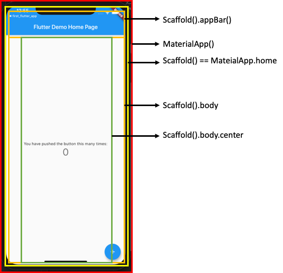
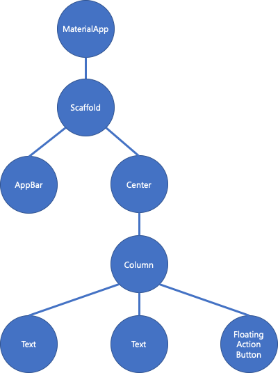

- STEP 1. 서론
- STEP 2. 본론
  - STEP 2. StatelessWidget vs StatefulWiget
    - STEP 2.1 StatelessWidget vs StatefulWiget
    - STEP 2.2 Stateless Widget
    - STEP 2.3 Stateful Widget
      - STEP 2.3.1 State란? 
    - STEP 2.3 StatelessWidget과 StatefulWidget 선택 방법
- STEP 3. 결론
- STEP 4. Reference

# Flutter - Widget, State, BuildContext 그리고 InheritedWidget Part 1
# STEP 1. 서론
Flutter 공식팀에서 Flutter에 대해서 소개하는 한 줄 코멘트가 있다.
> In Flutter, almost everything is a Widget.  

말 그대로 Flutter가 가장 강력한 이유라고 볼 수 있는 것이 심미적으로 아름다운 Material Design의 Widget들을 쉽고 빠르게 사용할 수 있으며, 추가적으로 이에 대한 속성 값을 변경하여 자유롭게 커스터마이징을 할 수 있게 해놨다는 점이다. 

우리는 단순하게 이게 어떠한 모양의 위젯이고, 어떤 속성을 갖고있으므로 어떠한 부분을 커스터마이징을 하기 위해서는 무엇을 바꾸면 된다. 정도만 해도 누구나 손 쉽게 어플리케이션 UI를 제작하는 시대가 왔다고 생각한다.

하지만 계속해서 강의를 들으면서 쓸데없는 시간 낭비라고 혹자는 말할지는 모르겠지만, 궁금한 부분이 생겨났었고 오늘은 그 부분에 대해서 정리를 하고자 한다. 


# STEP 2. 본론
> 플러터에서는 거의 모든 것이 위젯이다.  

그렇다면, 우리가 만든 위젯은 어떠한 방식으로 렌더링이 되는 것일까?
바로 위젯트리에 의해서 렌더링을 하게 된다.


```dart
class MyApp extends StatelessWidget {
  @override
  Widget build(BuildContext context) {
    return MaterialApp(
      title: 'Flutter Demo',
      theme: ThemeData(
        primarySwatch: Colors.blue,
      ),
      home: MyHomePage(title: 'Flutter Demo Home Page'),
    );
  }
}

class MyHomePage extends StatefulWidget {
  MyHomePage({Key key, this.title}) : super(key: key);
  final String title;

  @override
  _MyHomePageState createState() => _MyHomePageState();
}

class _MyHomePageState extends State<MyHomePage> {
  int _counter = 0;

  void _incrementCounter() {
    setState(() {
      _counter++;
    });
  }

  @override
  Widget build(BuildContext context) {
    return Scaffold(
      appBar: AppBar(
        title: Text(widget.title),
      ),
      body: Center(
        child: Column(
          mainAxisAlignment: MainAxisAlignment.center,
          children: <Widget>[
            Text(
              'You have pushed the button this many times:',
            ),
            Text(
              '$_counter',
              style: Theme.of(context).textTheme.display1,
            ),
          ],
        ),
      ),
      floatingActionButton: FloatingActionButton(
        onPressed: _incrementCounter,
        tooltip: 'Increment',
        child: Icon(Icons.add),
      ), // This trailing comma makes auto-formatting nicer for build methods.
    );
  }
}
```

위의 소스코드는 Flutter 프로젝트를 생성하게 되면 처음 생기는 카운터 예제 어플리케이션이다. 

위에서부터 차근차근 살펴보겠다.

```dart
class MyApp extends StatelessWidget {
  @override
  Widget build(BuildContext context) {
    return MaterialApp(
      title: 'Flutter Demo',
      theme: ThemeData(
        primarySwatch: Colors.blue,
      ),
      home: MyHomePage(title: 'Flutter Demo Home Page'),
    );
  }
}
```

우리 어플리케이션의 최상위 노드라고 볼 수 있는 `Myapp` 클래스이다.
이 `Myapp` 클래스는 `StatelessWidget` 을 상속하여, `build()` 메소드를 오버라이딩해서 위젯을 렌더링하게 된다. 

이때 리턴 값으로 `MaterialApp()`  객체가 반환되는데 이 객체에 대한 설명은 나중에 하고, `home: MyHomePage(title: 'Flutter Demo Home Page')` 을 보자, 대충 이 객체가 무엇을 하는 놈인지는 모르겠지만, 웹 개발을 했던 사람이라면 **home**이라는 속성은 무엇인가 메인 페이지를 그릴 것 같다는 뉘앙스가 들 것이라고 생각한다.

자 그럼 아래 클래스를 봐보자.

```dart
class MyHomePage extends StatefulWidget {
  ... (중략) ...
}

class _MyHomePageState extends State<MyHomePage> {
  ... (중략) ...
  @override
  Widget build(BuildContext context) {
    return Scaffold(
      appBar: AppBar(
        title: Text(widget.title),
      ),
      body: Center(
        ... (중략) ...
      ),
      floatingActionButton: FloatingActionButton(
        ... (중략) ...
      ), 
    );
  }
}
```

위의 코드를 보면 길게 보이겠지만 하나하나 뜯어보면 별 거 없다. 
아까전에 언급했듯이 `MaterialApp()` 의 프로퍼티 속성으로 정의된 이 부분에서  `home: MyHomePage(title: 'Flutter Demo Home Page')`  
**MyHomePage** 객체 부분이라고 보면 될 것이다. 
여기서도 `build(BuildContext context)` 부분만 보자면, 얘는 다시 `Scaffold()` 객체에 프로퍼티들을 정의한 후 리턴하는 놈이라고 볼 수 있을 것이다.

대충 결과물에 대해서 그려보자면 이런식으로 그려진다고 볼 수 있다.



이를 위젯 트리 형식으로 그려보자면



이러한 형식으로 그려질 것이다. 

자 이제 좀 더 깊게 들어가보자, 그렇다면 우리가 위젯을 렌더링할 때 사용하는 
`Widget build(BuildContext context)`의 **빌드컨텍스트**는 무엇일까? 

빌드컨텍스트(BuildContext)는 **빌드 된 모든 위젯 트릭 구조 내의 위젯 위치에 대한 참조**이다. 즉, **트리의 부모자식 관계를 구성하기 위한 변수**라고 볼 수 있다. 

현재까지 내용을 정리하자면 
+ **위젯트리** : **Flutter에서 위젯 렌더링을 위해 위젯의 부모자식관계를 표현하는 것**
+ **빌드컨텍스트** : **빌드된 위젯 트리 구조 내에 위젯 위치에 대한 참조값**

이라고 볼 수 있다. 

그렇다면 위의 예제코드에서 `class MyApp extends StatelessWidget` 와 `class MyHomePage extends StatefulWidget` 에서의 `StatelessWidget` 와 `StatefulWidget` 는 무엇을 나타내는 것일까? 

## STEP 2.1 StatelessWidget vs StatefulWiget
Flutter에서 제공하는 위젯들은 크게 타입이 2가지로 나뉘어지게 된다.

1. **StatefulWidget** 
2. **StatelessWidget** 

이름에서도 뭔가 느낌이 오지않는가? Stateful Wiget은 상태 값(state)이 변화하는 위젯이라고 볼 수 있으며, Stateless Widget은 상태 값이 변화하지 않는 위젯이라고 볼 수 있다.

### STEP 2.2 Stateless Widget
이 위젯은 빌드 타이밍에 부모로 부터 받은 정보에 의존하는 컴포넌트이다.

**즉, 한 번 빌드되면 신경쓰지 않아도 된다는 말입니다.**

예시로는 Text(), Container(), Column() 등이 있다. 이러한 위젯들은 빌드할 때 파라미터를 단순히 전달한다. 이러한 파라미터를 전달해 한번 적용되면 **다시 빌드를 하기 전까지는 변하지가 않는 위젯**이다.

다시 위의 예제 코드를 살펴보자. 

```dart
void main() => runApp(MyApp());

class MyApp extends StatelessWidget {
  @override
  Widget build(BuildContext context) {
    return MaterialApp(
      title: 'Flutter Demo',
      theme: ThemeData(
        primarySwatch: Colors.blue,
      ),
      home: MyHomePage(title: 'Flutter Demo Home Page'),
    );
  }
}
```

우리가 실행시킬 **Main UI**가 담긴 `MyApp` 클래스가 **StatelessWidget**이라고 볼 수 있다. 이 StatelessWidget의 라이플 사이클은 매우 단순하다.  `build()` 메소드를 오버라이딩하여, 초기화를 수행한다. 	

### STEP 2.2 StatefulWidget
StatefulWidget과 같은 경우에는 위젯이 살아있는 경우, 내부 데이터를 다루는 위젯이다. 따라서 **데이터는 위젯이 살아 있는 동안 동적으로 변한다.**

이게 바로 StatelessWidget과 StatefulWidget의 가장 큰 차이점이라고 볼 수 있다.
이러한 **동적으로 변화하는 데이터의 집합**을 **State**라 부른다.

즉, StatefulWidget과 StatelessWidget의 가장 큰 차이점은 내부에 **State**를 갖고있는가? 없는가?로 볼 수 있다.

StatefulWidget과 같은 경우에는 내부에 State를 갖고 잇으며, 예로는 Silder(), CheckBox() 등이 있다.

아래 코드가 StatefulWidget의 예시이다.

```dart
class MyHomePage extends StatefulWidget {
  @override
_MyHomePageState createState() => _MyHomePageState();
}

class _MyHomePageState extends State<MyHomePage> {
  ... (중략) ...
  @override
  Widget build(BuildContext context) {
    return Scaffold(
      appBar: AppBar(
        title: Text(widget.title),
      ),
      body: Center(
        ... (중략) ...
      ),
      floatingActionButton: FloatingActionButton(
        ... (중략) ...
      ), 
    );
  }
}

```

StatelessWidget과 조금 다른 점은, 클래스가 StatefulWidget과 State위젯으로 나뉘어진다는 점이다. 이 부분은 나 또한 궁금해서 찾아봤는데, 성능차이 때문에 분할했다는 내용을 많이 보았다. (틀렸으면 지적부탁드립니다.)

그렇다면 StatefulWidget의 라이프사이클은 어떻게 될까?


1. **createState()**  
  + Flutter가 StatefulWidget을 만들 경우 즉시 실행
2. **mounted is true**
  + `createState()`가 호출되면 `buildContext`가 state에 할당됌.
    + `this.mounted = true` : buildContext가 state에 할당완료
    + `this.mounted = false` : buildContext가 state에 할당실패
    -> false일 경우 `setState()` 호출 시 에러 발생 가능성 존재
3. **initState()**
  + 위젯 인스턴스를 만들기 위해 **BuildContext**를 이용해 데이터 초기화
4. **didChangeDependencies()**
  + `initState()` 호출 이후 실행 의존하는 객체가 호출될 때마다 호출 
5. **build()**
  + 위젯을 리턴
  + `setState()` 호출될 때마다 호출된다.
6. **didUpdateWidget(Widget oldWidget)**
  + 부모 위젯이 업데이트 되거나 이 위젯을 다시 만들 경우 호출 
7. **deactivate()**
  + 해당 widget이 트리에서 제거되는 순간 호출
8. **dispose()**
  + 모든 렌더링이 완전히 끝난 후, 자원 해제를 위해 호출 
9. **mounted is false**

자세한 내용은 [Newbie Chapter 4. Widget’s state - nhancv's blog](https://nhancv.com/newbie-chapter-4-widgets-state/)을 참고해보도록 하자.
라이플 사이클만 봐도 Stateful Widget은 State가 관리되는 것이 핵심이라고도 볼 수 있어보인다. 그렇다면? State는 정확히 무슨 일을 할까?

### STEP 2.2.1 State란? 
위에서 설명한 대로 State의 정의는 **동적으로 변화하는 데이터의 집합**이고, 이걸 프로그래밍적으로 보자면 , **StatefulWidget 인스턴스의 "행동"을 정의하는 부분**이라고 볼 수 있다.

 그렇기에, **State는 위젯의 동작과 레이아웃을 위한 정보**를 가지고 있으며, **State가 변경되면 위젯은 리빌드**가 된다.

나름 중요하다고 생각하는 부분은 위에 Stateful Widget 라이프 사이클에서 2번 부분을  참고하면, `createState()` 이후에 `BuildContext`가 **State**에  할당되는 부분이다.  이때, State와 해당 BuildContext 사이에는 영구적인 연관관계가 생기며, State가 BuildContext를 절대 변경할 수 없게 만든다.

만약, 해당 BuildContext가 다른 트리 구조로 이동되는 것이 가능하다고 해도, State는 한번 mount된 BuildContext와 연결을 유지하게 된다. 

이는 즉, **State가 mount된 BuildContext가 아닌 다른 BuildContext에 접근가능하지 않게끔 하려는 의도**로 보인다. 

### STEP 2.3 StatelessWidget과 StatefulWidget 선택 방법
위에서 좀 깊게 StatelessWidget과 StatefulWidget을 다뤄봤다. 따라서 이 글을 보신 분들이라면 스스로 아래의 질문을 할 수가 있을 것이다.

> 내 위젯이 라이플사이클 동안 변경될 변수를 고려해야 하며, 변경 시 위젯이 강제로 재구성이 될 수 있는가?   

스스로에게 질문을 해보고 내가 사용할 위젯이 해당 사항이 있다면, StatefulWiget으로 구성하면 되는 것이고, 아니라면 StatelessWidget으로 선택하면 된다.

위의 질문에 구체적으로 안떠올린다 하면 아래의 예시와 자신이 만들 위젯과 비교해보자.

**1. 체크박스를 보여줘야하는 위젯이 있다.**

체크박스의 리스트는 배열로 구성되어 있고, 배열의 원소들은 각각 객체이며 그 객체들은 제목과 상태를갖는다.
그리고, 당신이 클릭을 했을 때 배열의 원소의 상태 값이 변화한다.

-> 이 경우에는 **StatefulWidget**을 사용하는 것이 좋다. 왜 일까?

바로, **배열의 원소들의 상태 값을 기억하여 체크박스를 다시 그리게끔 해야되기 때문이다.**

**2. 회원가입을 하는 폼이 있다고 가정해보자.** 

이 폼은 유저에게 입력을 받아서 서버에 데이터를 전달하는 용도이다. 폼 검증은 서버 단에서 처리한다고 가정한다.

-> 이 경우에는 **StatelessWidget**을 사용하는 것이 좋다. 왜 일까? 

바로, 폼을 검증하거나 제출하기 전에 **어떠한 행동을 위젯에서 처리할 것이 없기 때문이다.**

# STEP 3. 결론
지금까지 우리는 StatefulWidget과 StatelessWidget에 관해서 심층적으로 분석을 해봤다. 

다음에는 좀 더 깊이 들어가서 InheritedWidget에 대한 개념을 다뤄보도록 하겠다.

# STEP 4. REFERENCE
1. [Widget — State — BuildContext — InheritedWidget - Flutter Community - Medium](https://medium.com/flutter-community/widget-state-buildcontext-inheritedwidget-898d671b7956)

2. [paulaner80 :: Widget, State, BuildContext 그리고 InheritedWidget](https://paulaner80.tistory.com/entry/Widget-State-BuildContext-%EA%B7%B8%EB%A6%AC%EA%B3%A0-InheritedWidget)

3. [Flutter Buildcontext Class - JACE SHIM](https://jaceshim.github.io/2019/01/25/flutter-study-buildcontext-class/)

4. [Flutter Stateful Widget Lifecycle](https://javaexpert.tistory.com/974)

5. [Flutter 간단 정리하기 - 박성룡 ( Andrew park ) - Medium](https://medium.com/@pks2974/flutter-%EA%B0%84%EB%8B%A8-%EC%A0%95%EB%A6%AC%ED%95%98%EA%B8%B0-9532e16aff57)